```table-of-contents

```
# 修改程序部分
====项目服务器里新建了2个FB，如果要使用该程序，就直接替换====
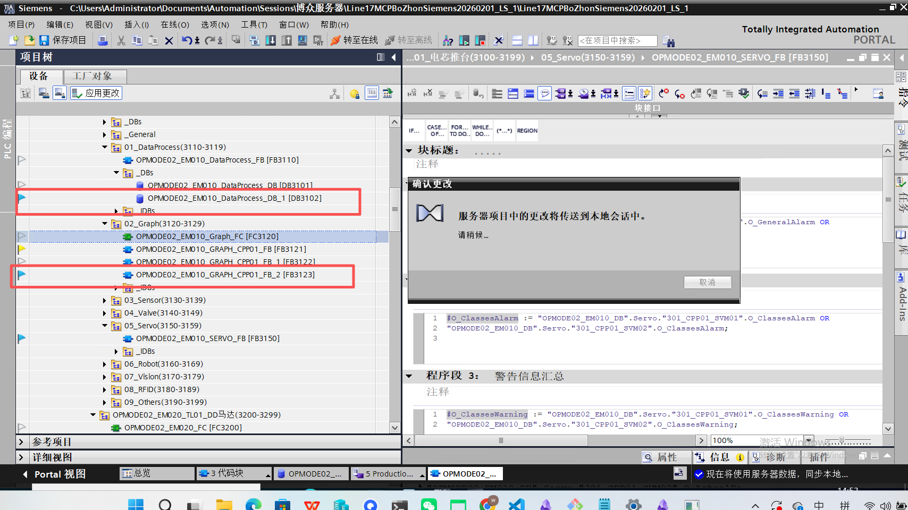
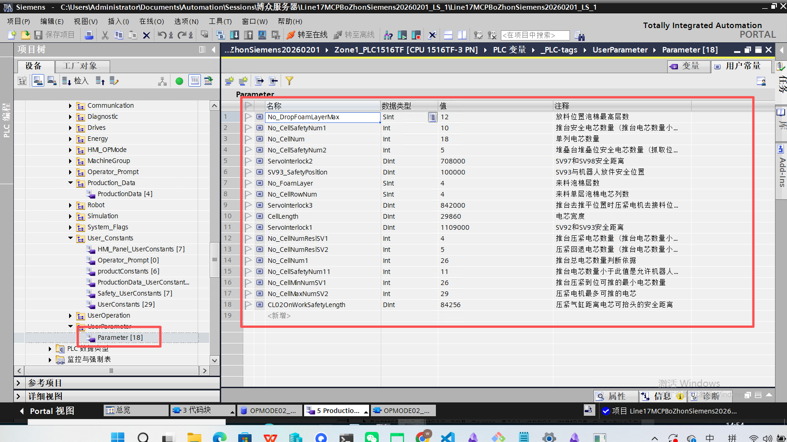
## graph修改地方
原来推台[6]压紧位置改为[7]由前固定指令动态调整


呼叫压紧电机接料的请求标志位上提到推台去压紧位置到位后就请求
推台推不到底由压紧电机推，推到底由推台推![[assets/OP20EM10程序逻辑/file-20260218215903607.png]]
由原来电芯计数下放改为压紧电机到了安全距离就下放![[assets/OP20EM10程序逻辑/file-20260218215903606.png]]
压紧电机是继续压紧还是去接料，由complete[1]来决定，当机器人没放完成，则继续压紧，下放完成立即转接料![[assets/OP20EM10程序逻辑/file-20260218215903895.png]]
OP2EM10伺服的推台由于位置一直动态调整，屏蔽位置丢失报错![[assets/OP20EM10程序逻辑/file-20260218215903609.png]]
# OP20EM10需要配置的参数
- [ ] SV93_SafetyPosition SV93与机器人放件安全位置
- [ ] No_CellMinNumSV1 推台压紧到位可推的最小电芯数量
- [ ] CellLength 电芯厚度（目前已经调整过，无需改动)
- [ ] "OPMODE02_EM010_DataProcess_DB".Servo_Data."301_CPP01_SVM02".Position[1].TeachValue[7] 1个电芯压紧到位的示教位置
- [ ] "OPMODE02_EM010_DataProcess_DB".Servo_Data."301_CPP01_SVM01".Position[1].TeachValue[6] 在No_CellMinNumSV1的电芯数量下，推台压紧到位的距离
- [ ] "No_CellMaxNumSV2" 压紧电机最多可推的电芯

# 程序逻辑
## SV93_SafetyPosition SV93作用
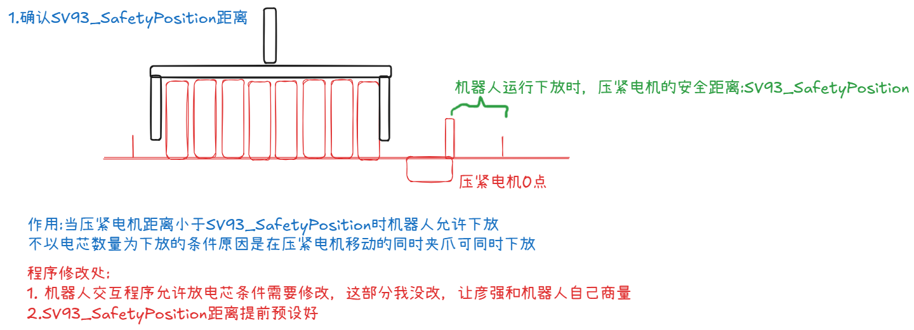
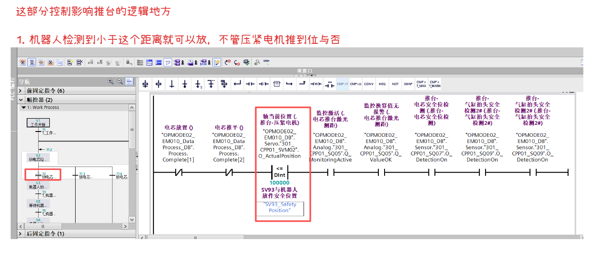
## 压紧电机逻辑说明
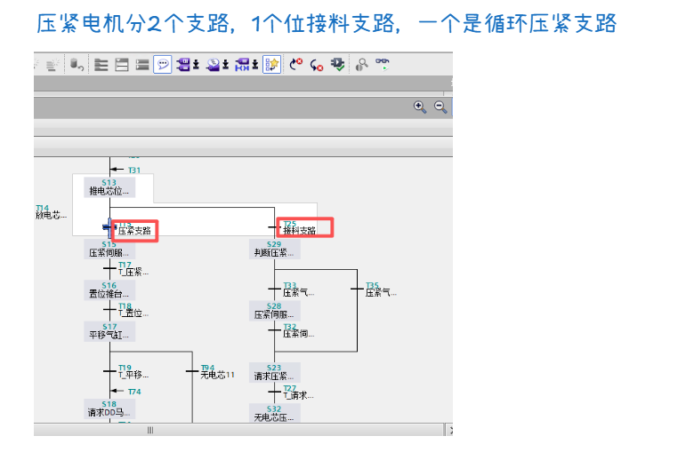
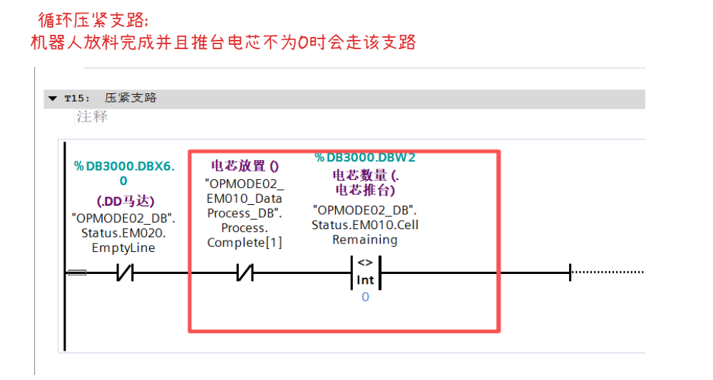
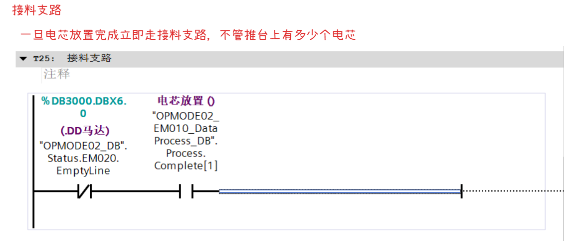
### Complete[1]变量完成条件
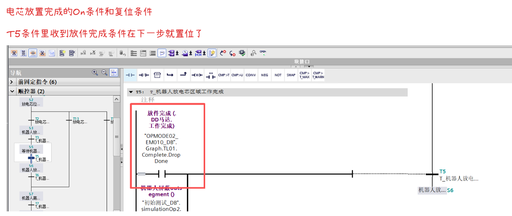
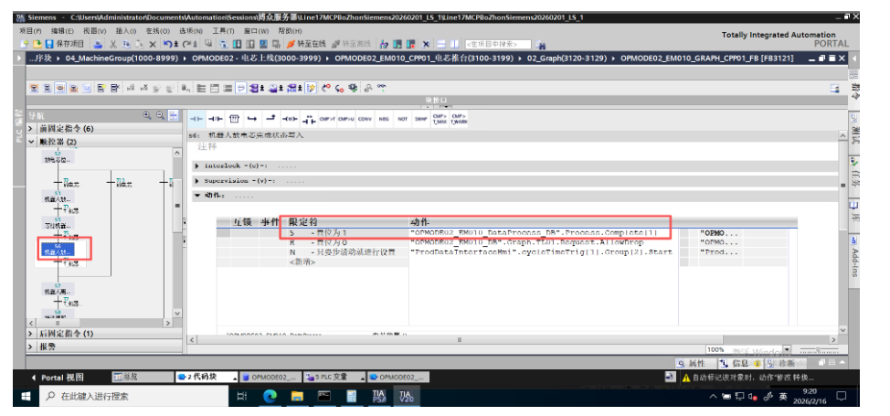
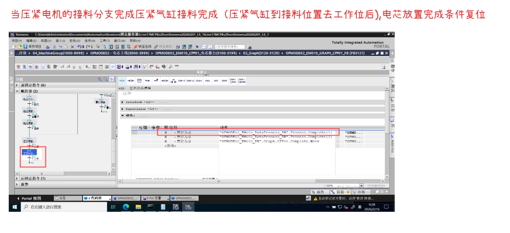
### 剩余电芯计算
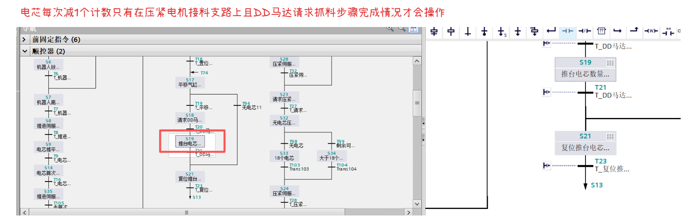
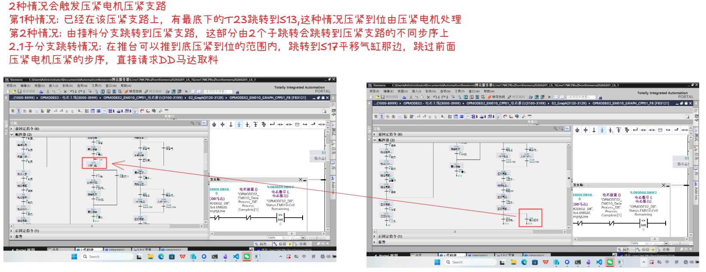
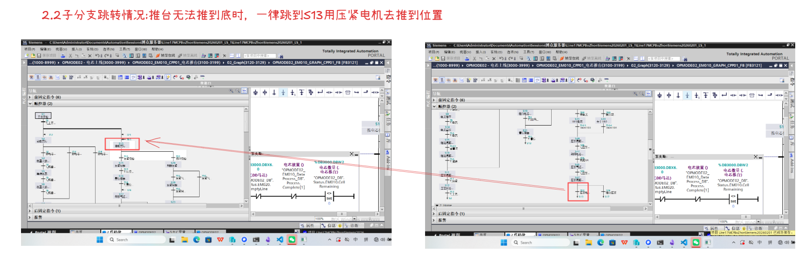
### 动态计算压紧电机接料的逻辑
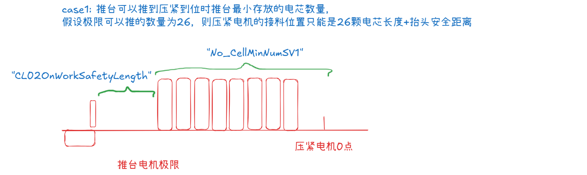
前固定指令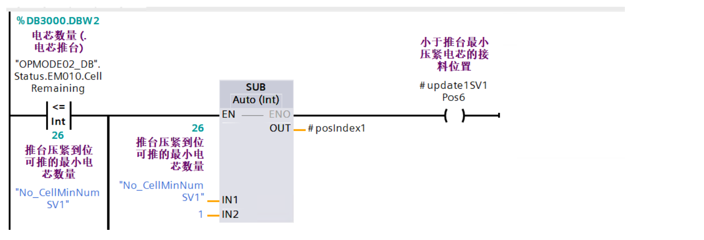
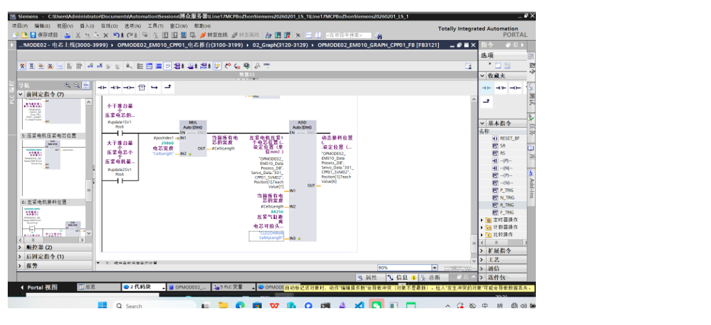
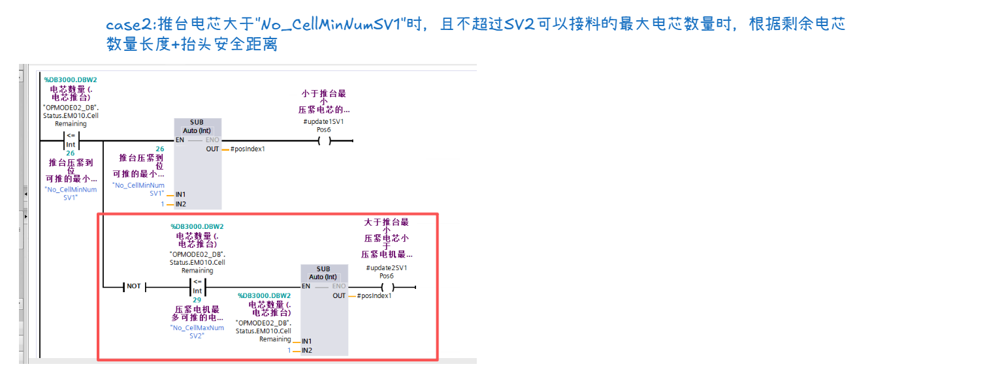
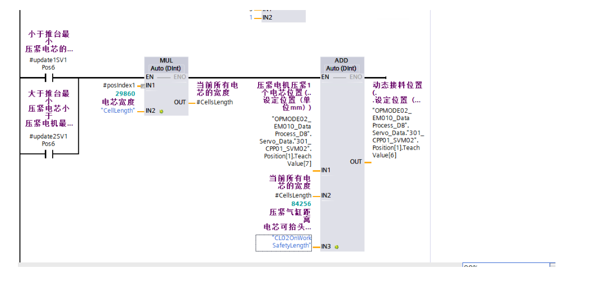
## 推台推到压紧位置的距离计算
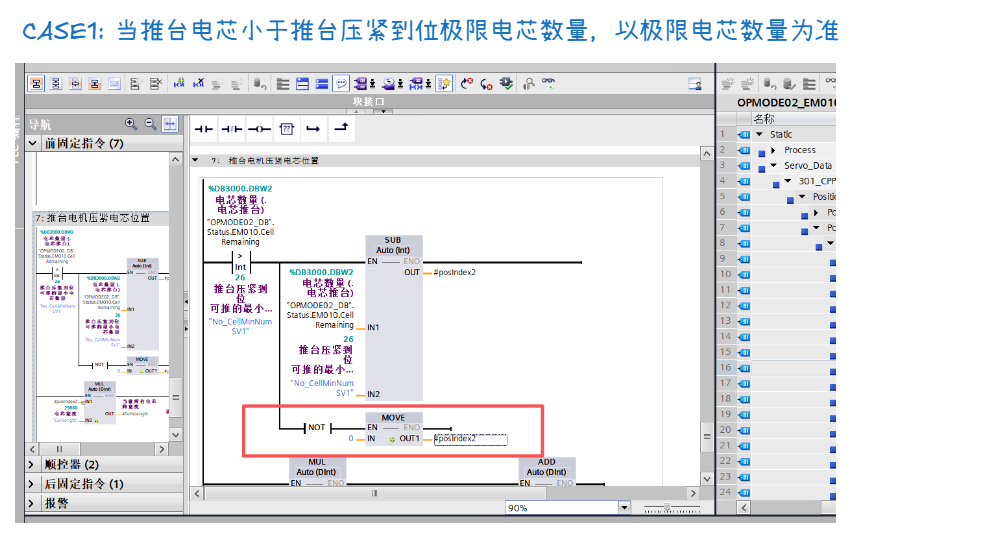
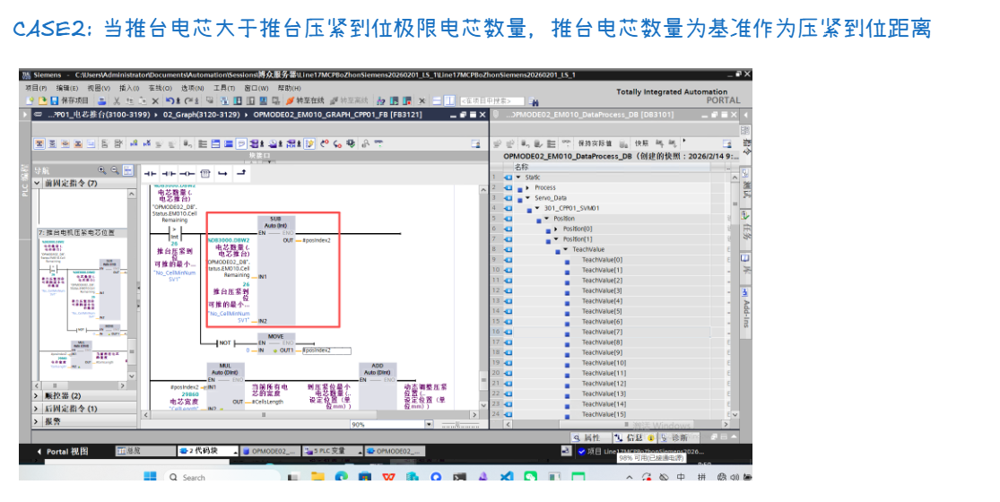

12